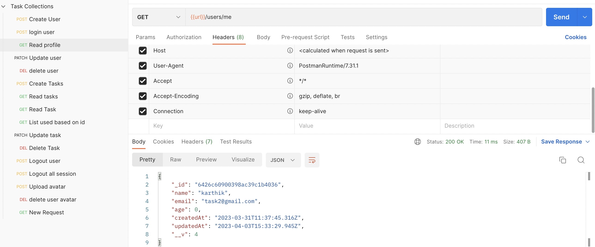

#### Tech Stack:
- MongoDB
- Mongoose
- JSON Web token
- Email integrations
 
## How to run application:
```
npm install
npm run dev
```
## Postman collections
- Import postman collection to play around the APIs 

## Mongoose
- Object Relation Model
- [Click here to learn more about mongoose](./learn/mongoose.md)
    
### REST API
- Representational State transfer - application  programming interfaces (REST API or RESTFul API)
- Lets take task scenario
    - CREATE -> POST /tasks
    - READ ->   GET /tasks
                GET /tasks/:id
    - UPDATE -> PATCH /tasks/:id
    - DELETE -> DELETE /tasks/:id 


// explain about : JWT Token
// mongodb -> how to connect
// mongoose -> functions
// expressjs
// routers
// models
// sorting,pagination,filtering
// file upload
// sharp npm
